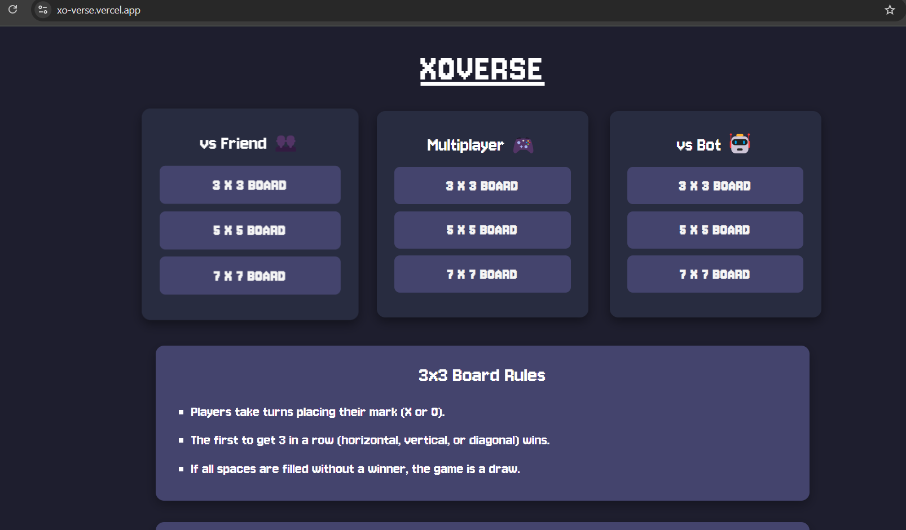
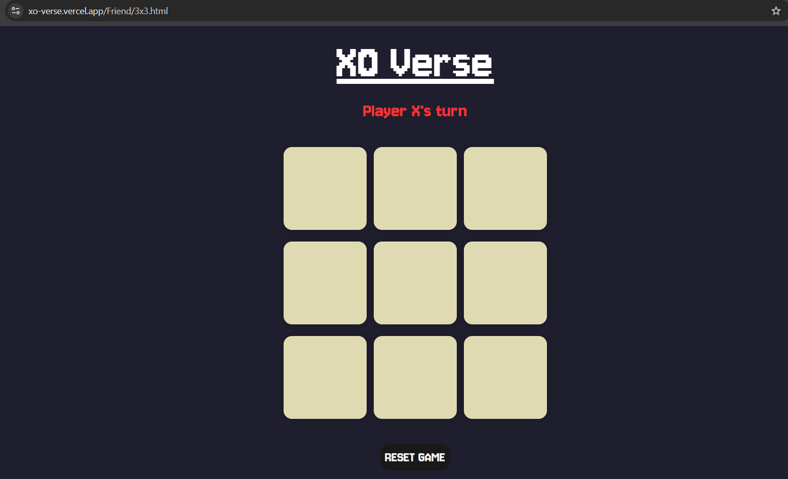

# XOVerse

XOVerse is an interactive and engaging web-based board game built using JavaScript, CSS, and HTML. It offers various board sizes (3x3, 5x5, 7x7) and follows the classic m,n,k gameplay rules, allowing players to play in multiple modes like versus friend, multiplayer, and against a bot.

## Features

- **Multiple Board Sizes**: Choose from 3x3, 5x5, or 7x7 boards for varying levels of difficulty.
- **Game Modes**:
  - **vsFriend**: Play with a friend on the same device.
  - **Multiplayer**: Play with others online.
  - **vsBot**: Play against an AI-controlled bot that uses the **Minimax** algorithm for decision-making.
- **Game Logic**: Efficient turn-based logic with checks for win conditions, draws, and player turns.
- **Scoring System**: Track and display player scores across multiple games.
- **Rules Section**: Clear and concise rules for each board size and game mode, ensuring players understand the game mechanics.

## Technologies Used

- **JavaScript**: For game logic and interactivity.
- **CSS**: For styling the game interface and responsiveness.
- **HTML**: For the game structure and layout.
- **Express**: For setting up the server.
- **WebSocket (ws)**: For real-time multiplayer interaction.
- **Minimax Algorithm**: Used by the bot to make optimal decisions during gameplay.

## Installation

To run the Multiplayer - game locally on your machine:

1.Clone this repository:
   ```bash
  git clone https://github.com/kadam-krishna/XOVerse.git
  ```
2.Navigate to the project directory:
  ```bash
  cd Multiplayer/3x3
  ```
3.Install the necessary dependencies:
  ```bash
  npm install express ws
  ```
4.Start the server:
  ```bash
  node server.js
  ```
5.Open your browser and go to http://localhost:3000 to start playing.


## Screenshots




## License

[](https://choosealicense.com/licenses/mit/)

